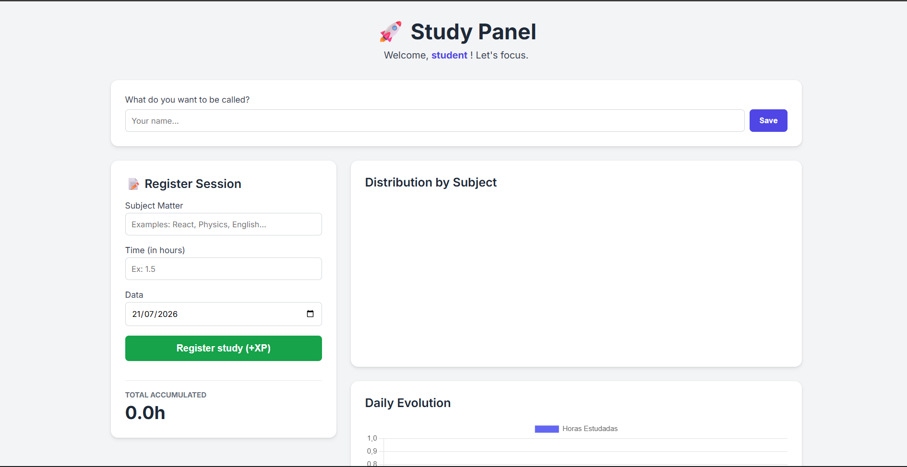
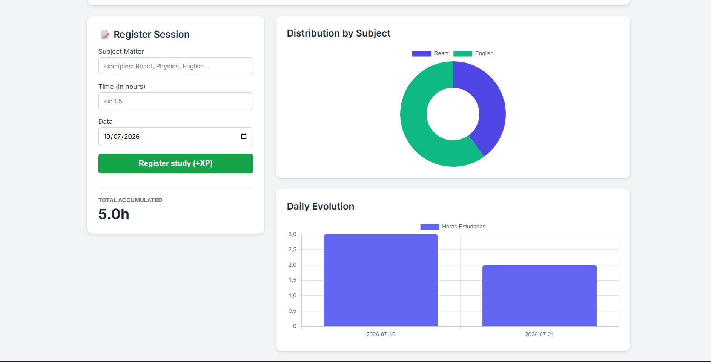

# XPStudy

Web application for study tracking and gamification. Allows users to log study sessions, visualize progress with dynamic charts, and persist data locally via LocalStorage — no backend or sign-up required.

## 🔗 Demo

👉 [Try Estudo XP](https://fredson-sy.github.io/XPStudy/)

## 📸 Screenshots

  
  

## ✨ Features

- Log study sessions (subject, topic, time, and date)
- Customizable username, saved locally
- Doughnut chart showing hours distributed by subject
- Bar chart showing daily study progress over time
- Recent history of the last 5 sessions
- Total accumulated study hours
- Data persistence via LocalStorage (no login or server required)

## 🛠️ Tech Stack

- Semantic HTML5
- CSS3 (Grid Layout, CSS variables, responsive design)
- Vanilla JavaScript
- [Chart.js](https://www.chartjs.org/)
- LocalStorage API

## ⚙️ Running Locally

\`\`\`bash
git clone https://github.com/Fredson-Sy/XPStudy.git
cd XPStudy
python -m http.server 8080
\`\`\`

Then open `http://localhost:8080` in your browser.

## 🧠 What I Learned

- Syncing LocalStorage data with dynamic Chart.js charts, including properly destroying old chart instances before re-rendering
- Using CSS custom properties as a single source of truth for colors, read dynamically in JavaScript via `getComputedStyle`
- Building a responsive layout with CSS Grid (single column on mobile, 1:2 ratio on desktop)

## 📄 License

MIT
